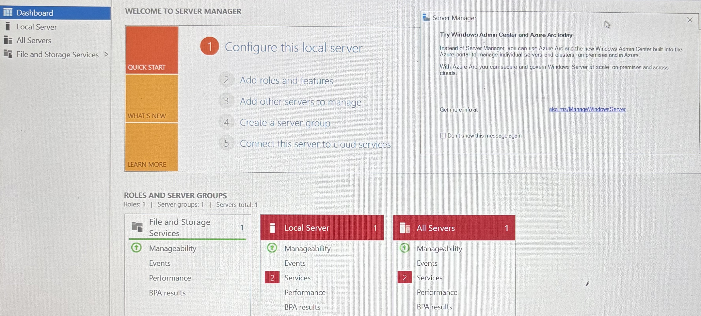
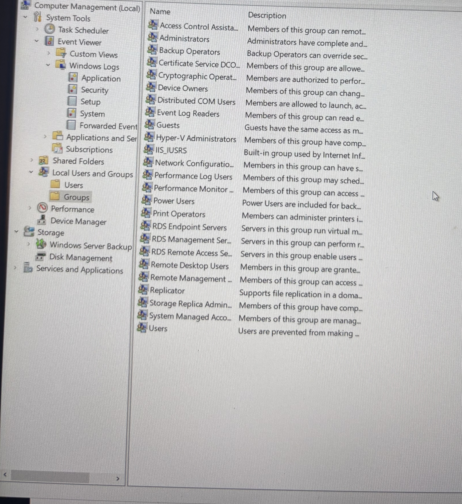
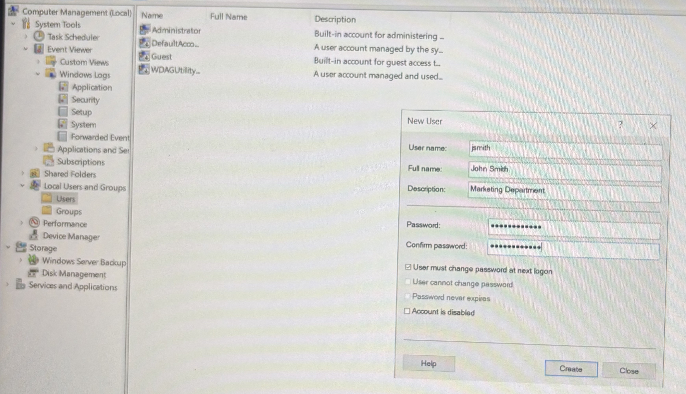
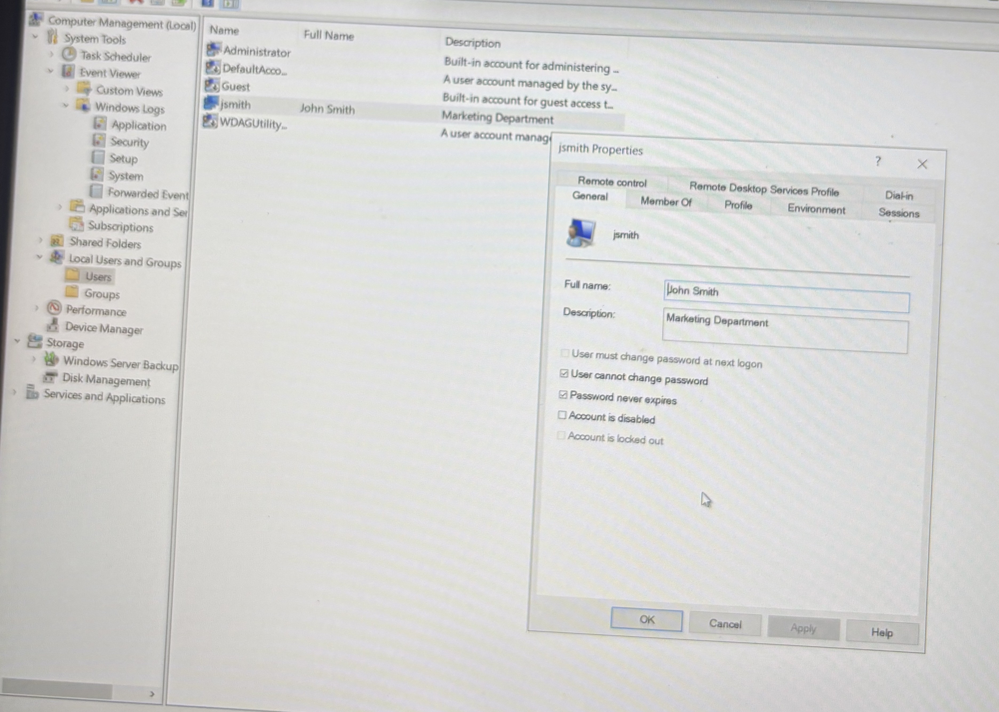
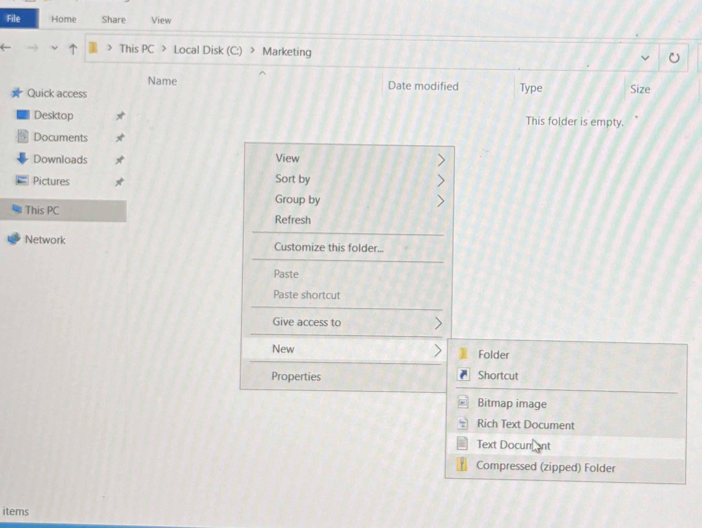
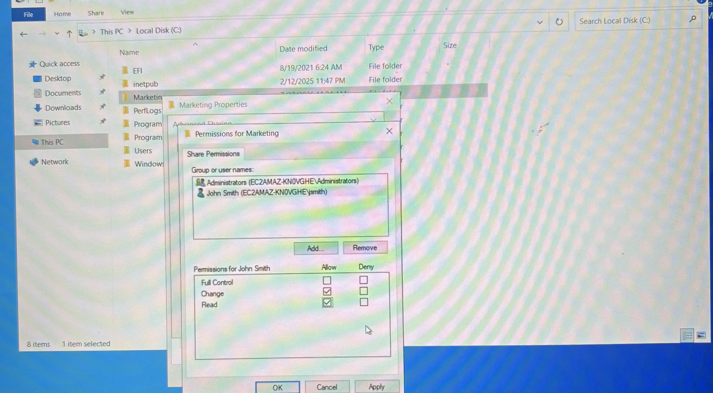
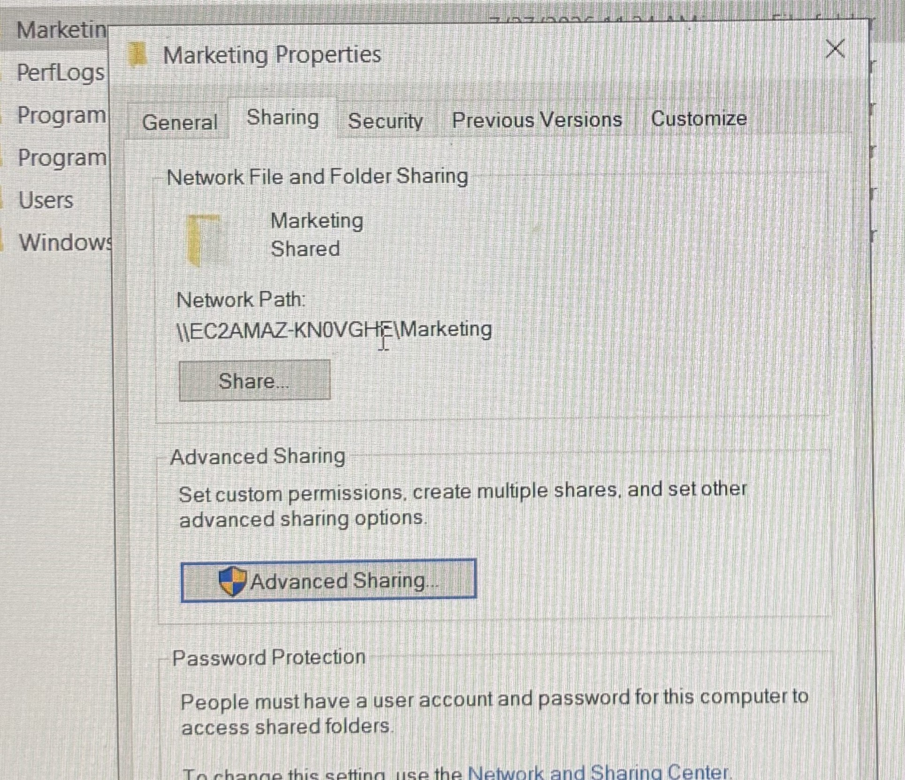
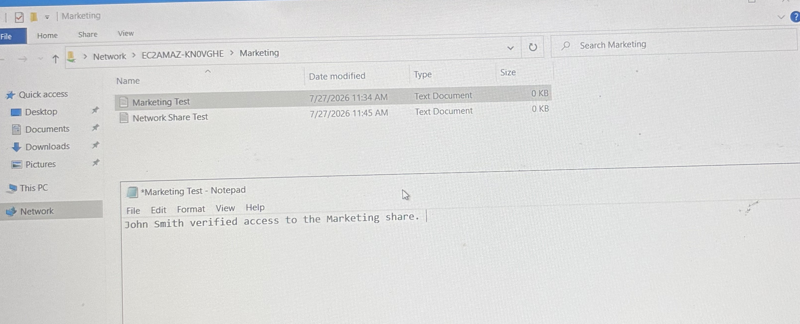
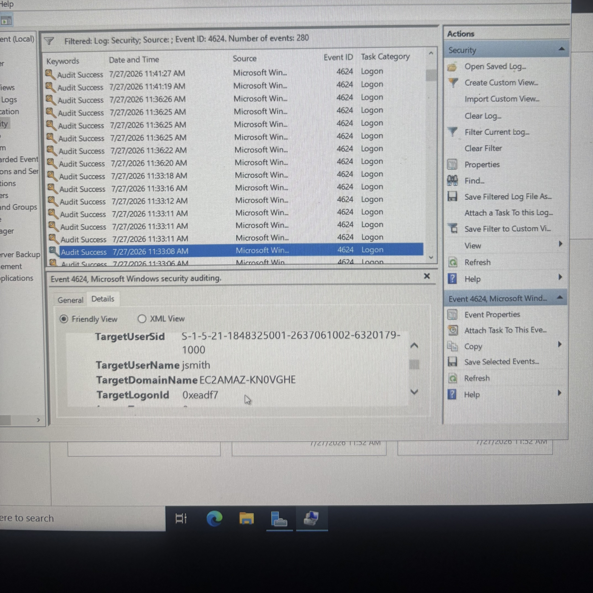

# AWS Windows Server Administration Lab

## Project Overview
This project demonstrates hands-on Windows Server administration in an AWS EC2 environment. The lab focused on deploying and managing a Windows Server instance, configuring user access, implementing least-privilege file permissions, creating an SMB network share, and analyzing Windows security events.

## Technologies Used
- Amazon Web Services (AWS)
- Amazon EC2
- Windows Server 2022
- Remote Desktop Protocol (RDP)
- NTFS Permissions
- SMB File Sharing
- Windows Event Viewer
- Local Users and Groups

## Lab Objectives
- Deploy and remotely administer a Windows Server EC2 instance
- Create and manage local user accounts and groups
- Configure NTFS permissions using least privilege
- Create and secure an SMB network share
- Test user access and file permissions
- Monitor successful and failed authentication events
- Troubleshoot access and connectivity issues

## Implementation

### 1. Windows Server Deployment

*Windows Server 2022 environment used for the AWS EC2 administration lab.*

### 2. User and Access Management
Created and managed local user accounts and configured group membership to control access to server resources.

*Reviewed Windows Server local groups used to manage user access and privileges.*

*Created the `jsmith` local user account for John Smith and associated the account with the Marketing Department.*

*Verified the newly created `jsmith` account and its configured user properties.*

### 3. NTFS Permissions
Created a departmental folder and configured NTFS permissions to provide the required access without granting unnecessary administrative privileges.

*Created the `C:\Marketing` departmental folder used for file-access and sharing configuration.*
### 4. SMB File Sharing
Configured an SMB network share and applied share permissions to control network-based access to departmental resources.

*Configured the Marketing share so the standard user received Change and Read access without Full Control.*

*Published the Marketing folder as an SMB network share and verified its network path.*

### 5. Access Validation
Tested access using a standard user account to verify that NTFS and share permissions operated as intended.

*Verified authorized access to the Marketing network share and successfully created a test file.*

### 6. Security Event Monitoring
Used Windows Event Viewer to investigate authentication activity, including:

- Event ID 4624 — Successful logon
- Event ID 4625 — Failed logon

*Used Windows Event Viewer to identify Event ID 4624 and confirm a successful authentication event associated with the `jsmith` user account.*

## Troubleshooting
## Troubleshooting
During the lab, I investigated network-share connectivity, authentication, user permissions, and access-control issues. Troubleshooting included verifying account configuration, network paths, NTFS permissions, share permissions, and Windows security logs.

## Key Takeaways
This project strengthened my understanding of Windows Server administration, least-privilege access control, SMB file sharing, authentication monitoring, and structured troubleshooting in a cloud-hosted environment.
